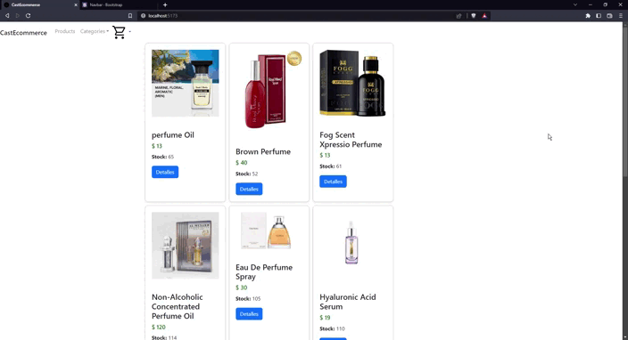

# E-commerce con React

Este proyecto es un ejemplo de cómo construir un e-commerce utilizando React como framework principal.

## Funcionalidades

- Barra de navegación (navbar) para navegar entre las diferentes secciones del sitio web.
- Sistema de ruteo para poder acceder a las diferentes páginas.
- Carrito de compra para que los usuarios puedan agregar productos a su carrito y realizar compras.
- Logica de base datos para almacenar y gestionar pedidos del cliente

## Tecnologías utilizadas

- React como framework principal.
- React Router para el sistema de ruteo.
- Bootstrap para los estilos de la aplicación.
- Filtracion dinamica por categorias
- Sweetalert2 para el sistema de alertas
- Firebase para la base de datos

## Instalación

Para poder utilizar este proyecto, es necesario seguir los siguientes pasos:

1. Clonar este repositorio en tu computadora.
2. Instalar las dependencias utilizando `npm install`.
3. Iniciar la aplicación utilizando `npm run dev`.

## Social

- Linkedin: https://www.linkedin.com/in/diego-alejandro-casta%C3%B1eda-londo%C3%B1o-481679201/
- Instagram: https://www.instagram.com/diegocast2019/

